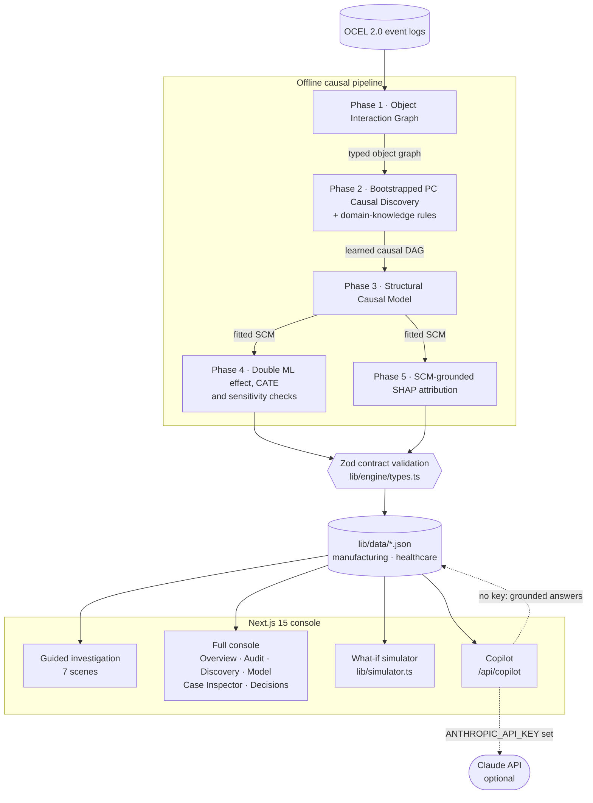

# CausalOCPM — A Causal Audit Layer for Agentic AI Decisions

> When AI agents make autonomous decisions, who explains the consequences?

CausalOCPM is a causal-reasoning console for transparent, explainable, and accountable
autonomous business processes. It combines **Object-Centric Process Mining** with
**Structural Causal Models** and **counterfactual reasoning** to reconstruct AI decision
pathways from event logs, discover the true causal drivers of outcomes, estimate their
effects free of confounding, and simulate "what if we had done differently?".

**Explain · Predict · Simulate.**
Shortlisted — AI Innovation Idea Hack, MIT Manipal.

<p align="center">
  <a href="docs/causalocpm-demo.mp4">
    
  </a>
  <br><sub>50-second walkthrough · <a href="docs/causalocpm-demo.mp4"><b>watch with narration</b></a></sub>
</p>

<p align="center">
  <a href="#the-problem">Problem</a> ·
  <a href="#what-causalocpm-does">What it does</a> ·
  <a href="#a-worked-example">Worked example</a> ·
  <a href="#the-console">Console</a> ·
  <a href="#architecture">Architecture</a> ·
  <a href="#the-pipeline">Pipeline</a> ·
  <a href="#evidence-and-validation">Evidence</a> ·
  <a href="#run-locally">Run</a> ·
  <a href="#project-layout">Layout</a> ·
  <a href="#deploy-to-vercel">Deploy</a>
</p>

---

## The problem

Autonomous agents now route orders, pick suppliers, assign clinicians and approve
exceptions. When an outcome goes wrong, today's tools fall short in the same way:

- **Dashboards show correlation, not cause.** A supplier sits next to long delays, so it
  gets dropped — but the delays don't move, because the real driver was something else.
- **Hidden confounders inflate the blame.** In our manufacturing data, complex orders are
  routed to one forge *and* are slow to machine regardless of supplier. That shared cause
  makes the forge look worse than it is.
- **Nobody can replay the road not taken.** "Would a different choice have helped, and by
  how much?" is a counterfactual question that event-log analytics can't answer.

## What CausalOCPM does

It turns an object-centric event log into a causal audit of every autonomous decision:

| Step | Question it answers | How |
| --- | --- | --- |
| **Explain** | What actually caused this outcome? | Object interaction graph → bootstrapped PC causal discovery → structural causal model |
| **Estimate** | How big is the real effect, free of confounding? | Double ML with backdoor adjustment, sensitivity-tested |
| **Attribute** | Why did *this* case end the way it did? | SCM-grounded SHAP, split into controllable vs. structural factors |
| **Simulate** | What if we had decided differently? | Counterfactual replay and an interactive what-if simulator |
| **Decide** | What should we do, and is it worth it? | Ranked actions with savings, capex, ROI and payback |

---

## A worked example

**Atlas Precision Aerostructures** — an agent sources forgings and keeps picking *Halcyon
Forge*. Line-side deliveries run late.

| | Days of delay attributed to Halcyon Forge |
| --- | --- |
| What a dashboard reports (naive) | **7.59** |
| What CausalOCPM recovers (Double ML) | **6.18** · 95% CI [6.08, 6.27] |
| Planted ground truth | 5.78 |
| Confounding removed | 1.41 days — Spec Complexity inflates the naive figure by ~23% |

The causal path is `Halcyon Forge dependency → Material Lead Time → Line-Side Delivery
Delay`; Spec Complexity is the confounder that sits behind both the sourcing choice and
the delay. Replaying order SC-20481 with the counterfactual choice (Meridian Tool & Die)
turns a **15.8-day** SLA breach into an **11.4-day** on-time delivery — **4.4 days saved**.
The recommended fix — shift ~25% of sourcing to Meridian — models a ~17% delay reduction,
~$410K/year in savings and a ~4.1-month payback.

The same pipeline runs unchanged on a second domain:

| Domain | Tenant | Outcome | Naive → recovered | Confounder |
| --- | --- | --- | --- | --- |
| **Manufacturing** | Atlas Precision Aerostructures | Line-Side Delivery Delay (days) | 7.59 → **6.18** | Spec Complexity |
| **Healthcare** | Meridian Health System | Length of Stay (days) | 6.01 → **5.25** | Patient Complexity |

Both datasets are synthetic with **planted ground truth** — the only way to verify causal
inference, since real data never reveals the counterfactual.

---

## The console

A Next.js 15 decision-intelligence console. It opens on a **guided investigation** — a
seven-scene story that walks one flagged decision from incident to verdict — and you can
skip to the **full console** at any time.

**Guided investigation:** Incident → What happened → What caused it → What if → Change the
cause → What to do → Can we trust it.

**Full console (9 views):**

| View | What you get |
| --- | --- |
| **Overview** | Causal-intelligence alert, AI executive summary, discovery-validation badges, top drivers, traditional-PM-vs-CausalOCPM comparison |
| **Decision Audit** | Audit a single AI decision: what the agent weighed, what it couldn't see, and what actually caused the outcome with confounding removed |
| **Live Supply Chain** | Digital-twin view of the network and its queue |
| **Data & Discovery** | Six-step walkthrough from raw events to a validated causal graph, plus a raw-data preview and OCEL-style sample events |
| **Model Performance** | Naive vs. Double ML effect, the **What-If Causal Simulator** (intervention levers → predicted outcome, throughput, risk, ROI, effect-decomposition waterfall), estimated-vs-ground-truth coefficients, CATE heterogeneity |
| **Case Inspector** | Per-case SHAP waterfall, controllable-vs-structural split, percentile, counterfactual, similar cases |
| **Decision Intelligence** | Ranked actions with ROI / capex / timeline, projected-impact trend, an executive causal-analysis report, action log |
| **Copilot** | Grounded assistant — live Claude when `ANTHROPIC_API_KEY` is set, deterministic grounded answers otherwise |
| **Settings** | Scenario configuration and pipeline toggles |

A **Causal Audit Score** (0–100) summarises how far an analysis can be trusted across
evidence completeness, effect recovery, causal confidence, discovery quality, confounding
robustness, counterfactual stability and explainability.

---

## Architecture

CausalOCPM is a five-phase causal pipeline that feeds a Next.js console. The heavy
statistics run offline (a TypeScript builder, with a Python reference pipeline for
validation); the app reads validated JSON fixtures, so the console is fast and needs no
backend to run.



## The pipeline

```
OCEL 2.0 logs → Object Interaction Graph → Bootstrapped PC (DAG) → Mixed SCM → Double ML → SCM-grounded SHAP
```

1. **Object interaction graph** — how orders, machines, workers, materials and shipments co-occur.
2. **Bootstrapped PC discovery** — constraint-based causal discovery, repeated over resampled data; only edges that are stable across runs are kept, trading recall for trustworthiness.
3. **Domain-knowledge layer** — expert rules recover missed edges and prune spurious ones, with every change shown.
4. **Mixed SCM** — a structural causal model fitted over the validated graph.
5. **Double ML** — cross-fitted gradient boosting with sandwich standard errors and backdoor adjustment.
6. **Sensitivity** — placebo test, random-common-cause test, VanderWeele E-value, hidden-confounder sweep and multi-seed robustness.
7. **SCM-grounded SHAP** — per-case attribution consistent with the causal structure.

The offline builder (`scripts/build-causal-fixtures.ts` + `scripts/lib/domainConfig.ts`)
encodes the planted causal structure for each domain, runs the effect, CATE and
sensitivity logic, and validates the result against a shared Zod contract
(`lib/engine/types.ts`) before writing `lib/data/<domain>.json`. It runs on `prebuild`.
The what-if simulator (`lib/simulator.ts`) propagates intervention levers through the
structural equations to a predicted outcome, mediator states and a decomposition waterfall.

---

## Evidence and validation

The numbers in the console are not hand-typed. The manufacturing figures come from a
from-scratch run of the Python reference pipeline in
`scripts/reference/atlas-manufacturing/` — real bootstrapped PC (`causal-learn`) and real
Double ML (5-fold cross-fitted `sklearn` gradient boosting) on a 20,000-row event log.

| Check (manufacturing) | Result |
| --- | --- |
| Double ML vs. planted effect | 6.18 vs. 5.78 days |
| Autonomous discovery | precision 0.89 · recall 0.89 · **F1 0.89** |
| Placebo (permuted treatment) | −0.01 ≈ 0 |
| Random common cause | 6.17 (stable) |
| VanderWeele E-value | 5.7 |
| 10-seed robustness | causal 6.10 ± 0.04; naive range 7.43–7.56 |

The results are deliberately honest: discovery misses one real edge (a threshold effect
that a linear independence test barely sees) and includes one spurious but stable edge,
rather than reporting a too-clean 1.00. Full reports, generated logs and the methodology
live in [`docs/reference-run/`](docs/reference-run/). Presenter material:
[`docs/JUDGE_QA.md`](docs/JUDGE_QA.md) and [`docs/PITCH_DECK.md`](docs/PITCH_DECK.md).

---

## Run locally

Requires Node.js 18.18+ (Next.js 15).

```bash
npm install
npm run gen:data      # regenerate the two validated fixtures (optional; prebuild does this)
npm run dev           # http://localhost:3000
```

Optional — live Copilot:

```bash
cp .env.example .env.local
# set ANTHROPIC_API_KEY=...
```

Without a key the Copilot answers from the fixtures with deterministic, grounded replies.

To reproduce the manufacturing reference run (needs `numpy`, `pandas`, `scikit-learn`,
`causal-learn`):

```bash
cd scripts/reference/atlas-manufacturing
python generate_data.py   # writes atlas_precision_synthetic.csv
python validate.py        # writes validate-report.txt + validate-summary.json
```

## Project layout

```
app/                    Next.js app router (page, layout, /api/copilot)
components/             Console shell, graph, charts, waterfall, guided story, tabs/
components/story/       The seven-scene guided investigation
lib/                    Fixtures loader, what-if simulator, copilot logic, engine types (Zod)
lib/data/               Generated, validated fixtures: manufacturing.json, healthcare.json
scripts/                Fixture builder + domain specs; Python reference pipeline
docs/                   Reference-run evidence, judge Q&A, pitch deck, demo video
```

## Deploy to Vercel

Repo: <https://github.com/Aditya0105singh/CAUSALOCPM-NEW>

1. Go to [vercel.com/new](https://vercel.com/new) and **Import** `Aditya0105singh/CAUSALOCPM-NEW`.
2. Framework is auto-detected as **Next.js** — leave every build setting at its default.
3. (Optional) add `ANTHROPIC_API_KEY` under *Environment Variables* for the live Copilot.
4. **Deploy.** `prebuild` regenerates and Zod-validates the fixtures during the build.

---

## Tech

Next.js 15 · React 19 · TypeScript · Tailwind CSS v4 · Recharts · Framer Motion · Zod ·
`@anthropic-ai/sdk`. Design language: warm-paper + forest-green editorial, Fraunces display
/ Inter text.
